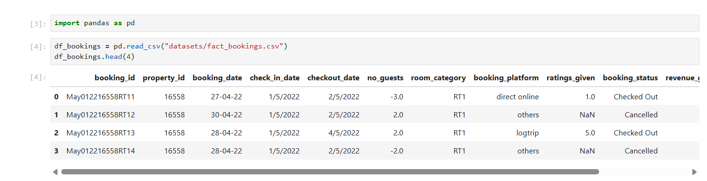
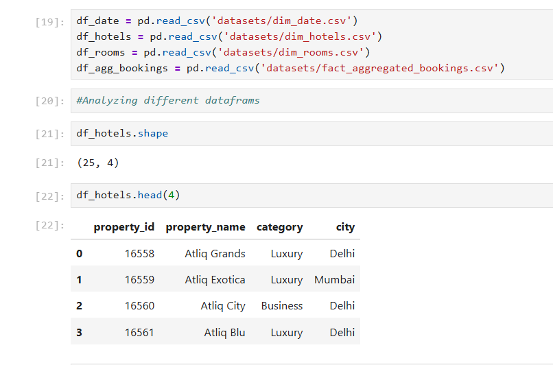
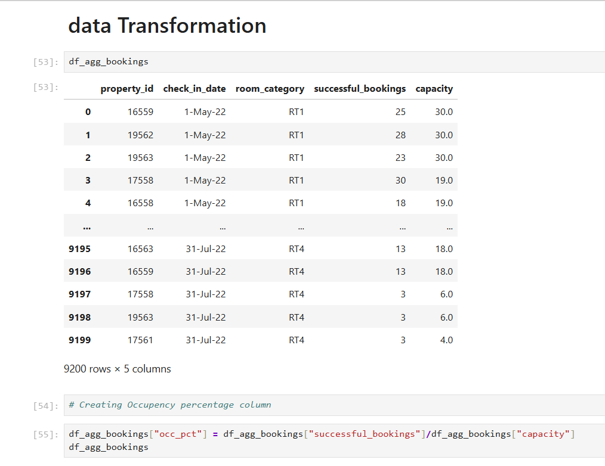
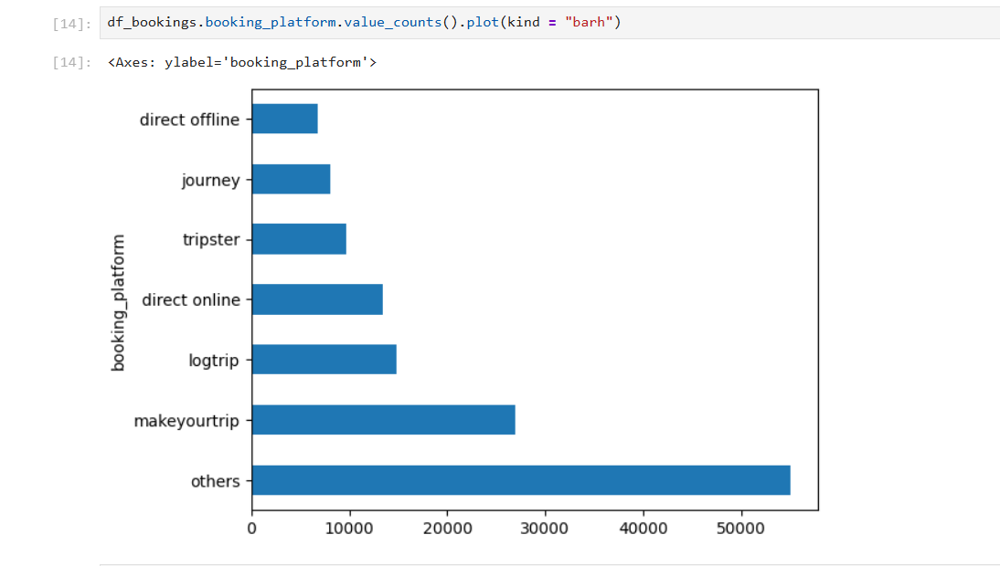
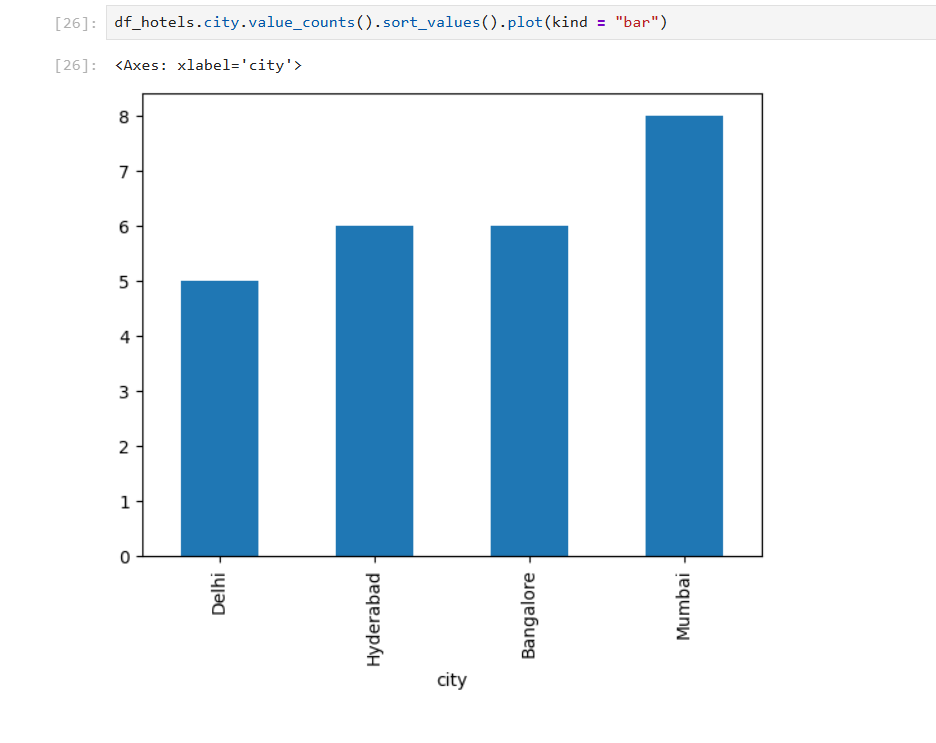
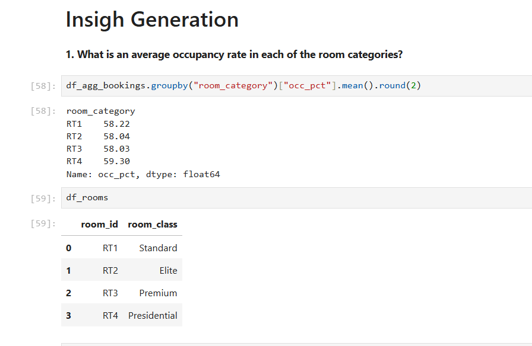
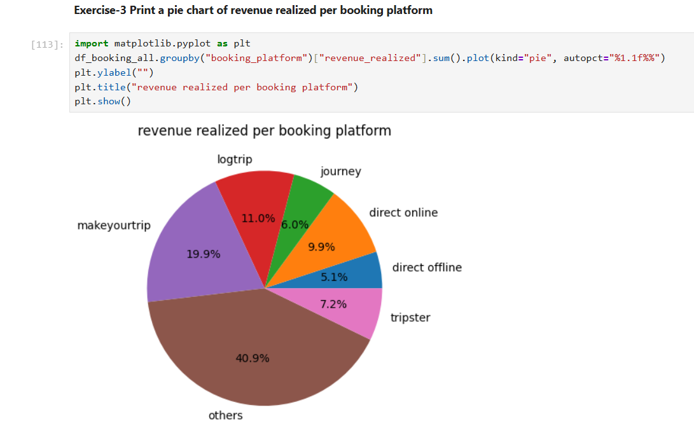
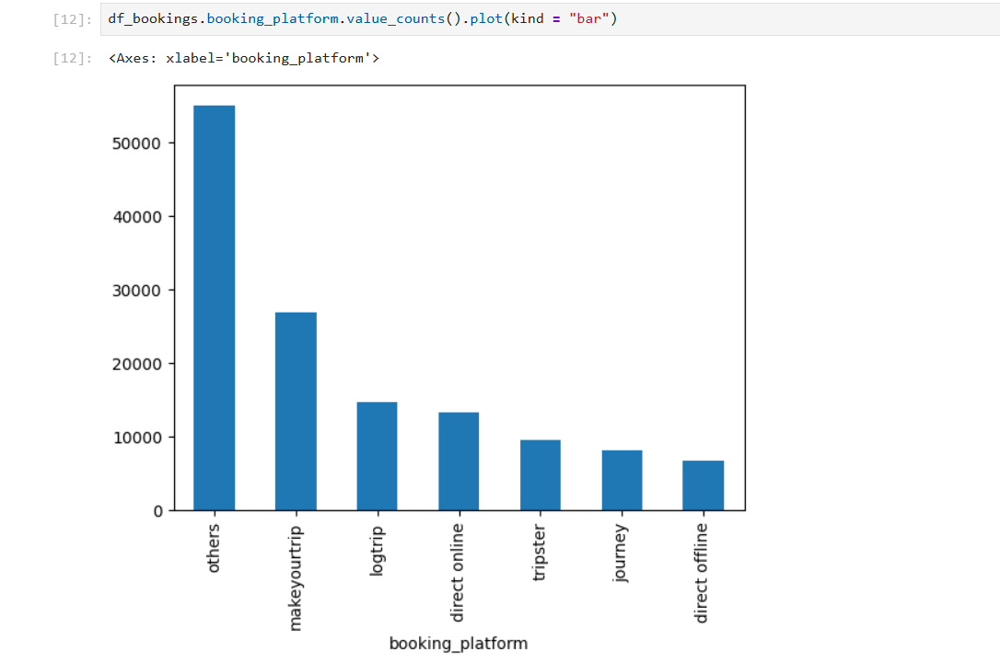

# 🏨 Hospitality Data Analytics Project

An end-to-end data analytics project focused on extracting actionable business insights from hospitality industry data using **Python, Pandas, and Matplotlib**.

This project covers the complete workflow:

**Data Loading → Cleaning → Transformation → Exploratory Data Analysis → Insight Generation → Revenue Analysis**

---

# 📌 Project Workflow & Insights

---

## 1️⃣ Project Setup & Data Loading



### What Was Done:
- Imported pandas and loaded booking datasets.
- Examined dataset structure using `.head()` and `.shape()`.

### Key Observation:
- The dataset includes booking information such as check-in date, checkout date, room category, booking platform, revenue generated, and booking status.

---

## 2️⃣ Understanding Data Structure



### What Was Done:
- Loaded supporting datasets: hotels, rooms, dates, and aggregated bookings.
- Reviewed schema and relationships between tables.

### Key Observation:
- Multiple fact and dimension tables exist.
- Proper joins are necessary for meaningful analysis.

---

## 3️⃣ Data Cleaning


### What Was Done:
- Identified invalid values (e.g., negative number of guests).
- Checked missing ratings and booking inconsistencies.

### Key Insight:
- Data contained anomalies such as negative guest counts.
- Cleaning was necessary before calculating occupancy metrics.

---

## 4️⃣ Data Transformation



### What Was Done:
Created occupancy percentage column:

```
occupancy = successful_bookings / capacity
```

### Business Impact:
- Enabled measurement of room utilization performance.
- Prepared dataset for category-wise comparison.

---

## 5️⃣ Exploratory Data Analysis (EDA)



### What Was Done:
- Analyzed booking platform distribution.
- Compared frequency across platforms.

### Key Insight:
- "Others" and "MakeYourTrip" dominate booking volume.
- Direct channels contribute significantly but are not the largest.

---

## 6️⃣ City Distribution of Hotels



### Insight:
- Mumbai has the highest property count.
- Delhi and Bangalore also show strong presence.
- Indicates metro-focused expansion strategy.

---

## 7️⃣ Insight Generation – Occupancy Rate by Room Category



### Key Results:

| Room Category | Avg Occupancy % |
|--------------|----------------|
| RT1 (Standard) | 58.22% |
| RT2 (Elite)    | 58.04% |
| RT3 (Premium)  | 58.03% |
| RT4 (Presidential) | 59.30% |

### Business Insight:
- All room categories perform similarly (~58–59%).
- Premium and Presidential rooms slightly outperform others.

---

## 8️⃣ Revenue Analysis – Platform Contribution



### Key Insight:
- "Others" category contributes the highest revenue (~40%).
- MakeYourTrip is the second largest revenue driver.
- Direct offline contributes the least revenue.

### Business Implication:
- Heavy dependency on third-party aggregators.
- Opportunity exists to grow direct booking channels.

---

## 9️⃣ Booking Volume by Platform



### Insight:
- Booking volume distribution aligns closely with revenue contribution.
- Platforms driving volume also drive revenue.

---

# 📊 Key Business Conclusions

- Overall occupancy rate averages around 58%.
- Revenue is concentrated in aggregator platforms.
- Mumbai shows strongest property presence.
- Direct channels have growth potential.
- Room categories perform consistently across segments.

---

# 🛠 Tech Stack

- Python  
- Pandas  
- Matplotlib  
- Jupyter Notebook  

---

# 📁 Project Structure

```
hospitality-data-analytics/
│
├── datasets/
├── assets/
├── hotels_analysis.ipynb
├── exercise_solution.ipynb
└── README.md
```

---

# 🚀 Outcome

This project demonstrates:

- Data Cleaning & Validation  
- Data Transformation  
- Exploratory Data Analysis  
- Business Insight Generation  
- Visualization & Storytelling with Data  

---

## 👤 Author

**Deepak (ItsDebis)**  
Aspiring Data Analyst | Python & Pandas Enthusiast
